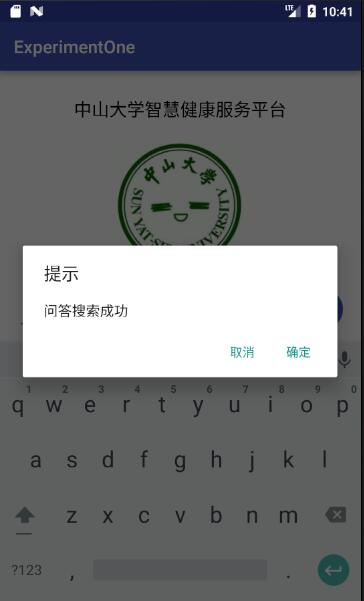

# 中山大学数据科学与计算机学院本科生实验报告
## （2018年秋季学期）
| 课程名称 | 手机平台应用开发 | 任课老师 | 郑贵锋 |
| :------------: | :-------------: | :------------: | :-------------: |
| 年级 | 大三 | 专业（方向） | 计应 |
| 学号 | 16340015 | 姓名 | 陈彬彬 |
| 电话 | 13590883387 | Email | 944131226@qq.com |
| 开始日期 | 2018/10/07 | 完成日期 |2018/10/07|

---

## 一、实验题目

**基础的事件处理**

---

## 二、实验目的

1. 了解Android编程基础。  

2. 熟悉Button、RadioButton、EditText等基本控件，能够处理这些控件的基本事件。

3. 学会弹出对话框，并定制对话框中的内容，能对确定和取消按钮的事件做处理。

   

***

## 三、实现内容

实现一个Android应用，界面呈现如图中的效果。  


  

要求

- 该界面为应用启动后看到的第一个界面。  
- 各控件处理的要求
  1. 点击搜索按钮：
     - 如果搜索内容为空，弹出Toast信息“**搜索内容不能为空**”。
     - 如果搜索内容为“Health”，根据选中的RadioButton项弹出如下对话框。  
       
       点击“确定”，弹出Toast信息——**对话框“确定”按钮被点击**。  
       点击“取消”，弹出Toast 信息——**对话框“取消”按钮被点击**。  
       否则弹出如下对话框，对话框点击效果同上。  
       
  2. RadioButton选择项切换：选择项切换之后，弹出Toast信息“**XX被选中**”，例如从图片切换到视频，弹出Toast信息“**视频被选中**”  

---

## 四、实验结果
### (1)实验截图

实验效果图：


### (2)实验步骤以及关键代码

1. 完成搜索按钮Button对于搜索内容为空的后台处理事件。

   根据[tutorial.md](https://gitee.com/SYSUcarey/PersonalProject1/blob/master/manual/tutorial.md)给的教程，在MainActivity.java文件中编写代码。涉及使用：

   - `findViewById`方法获取布局文件中的控件。
   - Button的`setOnClickListener`方法进行按钮监听。
   - 上者里面的`onClick`方法实现点击事件的处理。
   - 用`TextUtils.isEmpty`方法判断输入框是否为空。
   - Toast消息进行提醒。

   **关键代码**：

```java
Button button = (Button) findViewById(R.id.button1);
final EditText searchContent = (EditText) findViewById(R.id.search_box);
```

```java
button.setOnClickListener(new View.OnClickListener() {
    @Override
    public void onClick(View view) {
    // 事件处理
    if(TextUtils.isEmpty(searchContent.getText().toString())) {
        // 弹出Toast消息
        Toast.makeText(MainActivity.this,"搜索内容不能为空", Toast.LENGTH_SHORT).show();
    }
    //todo
}
```


2. 完成按钮Button对于非空搜索内容的后台处理事件。

   根据[tutorial.md](https://gitee.com/SYSUcarey/PersonalProject1/blob/master/manual/tutorial.md)给的教程，在MainActivity.java文件中编写代码。涉及使用：

   - AlertDialog对话框的使用
   - `getCheckedRadioButtonId`方法获取RadioGroup当前选中的按钮ID，根据不同选中的按钮Text，来决定对话框AlertDialog的消息内容Message。
   - `setPositiveButton`和`setNegativeButton`方法来响应对话框中正面按钮和反面按钮的响应事件。

   **关键代码：**

```java
AlertDialog.Builder builder = new AlertDialog.Builder(MainActivity.this);
    builder.setTitle("提示");
    String content = "问答";
    switch (radioGroup.getCheckedRadioButtonId()){
        case R.id.rb1:
            content = "图片";
            break;
        case R.id.rb2:
            content = "视频";
            break;
        case R.id.rb3:
            content = "问答";
            break;
        case R.id.rb4:
            content = "资讯";
            break;
    }
    builder.setMessage(content + "搜索成功");
    builder.setCancelable(false);
    // 设置正面按钮
    builder.setPositiveButton("确定", new DialogInterface.OnClickListener() {
        @Override
        public void onClick(DialogInterface dialog, int which) {
            Toast.makeText(MainActivity.this, "对话框\"确定\"按钮被点击", Toast.LENGTH_SHORT).show();
            dialog.dismiss();
        }
    });
    // 设置反面按钮
    builder.setNegativeButton("取消", new DialogInterface.OnClickListener() {
        @Override
        public void onClick(DialogInterface dialog, int which) {
            Toast.makeText(MainActivity.this, "对话框\"取消\"按钮被点击", Toast.LENGTH_SHORT).show();
            dialog.dismiss();
        }
    });
    AlertDialog dialog = builder.create();
    dialog.show();
```


3. RadioGroup中RadioButton切换时，弹出Toast消息提醒。

   需要使用到的知识点：

   - radioGroup的 `setOnCheckedChangeListener`方法对控件监听。

   - 上者函数里`onCheckedChanged`方法响应处理按钮切换时的事件。

```java
radioGroup.setOnCheckedChangeListener(new RadioGroup.OnCheckedChangeListener() {
    @Override
    public void onCheckedChanged(RadioGroup group, int checkedId) {
	    switch (checkedId) {
	        case R.id.rb1:
	            Toast.makeText(MainActivity.this,"图片被选中", Toast.LENGTH_SHORT).show();
	            break;
	        case R.id.rb2:
	            Toast.makeText(MainActivity.this,"视频被选中", Toast.LENGTH_SHORT).show();
	            break;
	        case R.id.rb3:
	            Toast.makeText(MainActivity.this,"问答被选中", Toast.LENGTH_SHORT).show();
	            break;
	        case R.id.rb4:
	            Toast.makeText(MainActivity.this,"资讯被选中", Toast.LENGTH_SHORT).show();
	            break;
	    }
    }
});
```

### (3)实验遇到的困难以及解决思路

1. MainActivity.java 中 Cannot  resolve symbol 'Button'

    解决方法：光标指向alt+enter，导入对应的Java包

    [参考博客链接](https://blog.csdn.net/hyr83960944/article/details/38438355)

2. AlertDialog的使用

   解决方法：[参考博客链接](https://blog.csdn.net/lindroid20/article/details/72639322)

3. 根据radioButton决定AlertDialog的Message内容。

    解决方法：

    `radioGroup.getCheckedRadioButtonId()`方法。

---

## 五、实验思考及感想

- 项目实验二难度同样不大，[tutorial.md](https://gitee.com/SYSUcarey/PersonalProject1/blob/master/manual/tutorial.md)教程给出了我们大致要使用的java后台方法，以及介绍了控件监听的流程，余下更多地我们要去查阅博客去丰富学习具体如何去进行控件监听，处理简单的事件响应。
- 之前做UI的时候，因为xml文件有Design可以预览到效果图，所以也没有太觉得模拟器的重要性，一直用真机测试。但到了这次实验，因为要进行后台事件处理，所以如果一直使用真机测试的话，有一点点的复杂，所以最好要下个模拟器，应该会方便一点，即使真机测试也蛮快的，但是如果没有数据线的时候就麻烦了。
- 实验一实验二后就要检查项目运行效果和报告了，看到[tutorial.md](https://gitee.com/SYSUcarey/PersonalProject1/blob/master/manual/tutorial.md)教程里面还有一些拓展知识，而自己只使用了里面关于资源style引用，感觉可以继续拓展一下。
