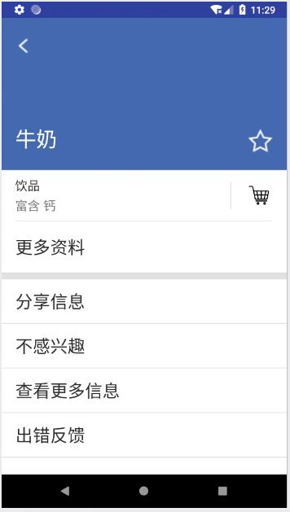

# Android application development
## 说明

- 中山大学安卓应用开发课程实验作业
- 随课程，代码托管在[gitee](https://gitee.com/SYSUcarey)

***

## 实验一 中山大学智慧健康服务平台

Android代码地址：

[https://github.com/SYSUcarey/Android_application_development/tree/master/Lab1/code/PersonalProject1](https://github.com/SYSUcarey/Android_application_development/tree/master/Lab1/code/PersonalProject1)

具体任务：

- 第四周学习任务：  基本的UI界面设计

- 第五周学习任务：  基础的事件处理

完成效果预览：

***

## 实验二 健康食品详情管理应用

Android代码地址：

[https://github.com/SYSUcarey/Android_application_development/tree/master/Lab2/code/PersonalProject1_FinalTask](https://github.com/SYSUcarey/Android_application_development/tree/master/Lab2/code/PersonalProject1_FinalTask)

具体任务：

- 第六周学习任务：Intent、Bundle的使用以及RecyclerView、ListView的应用

完成效果预览：

